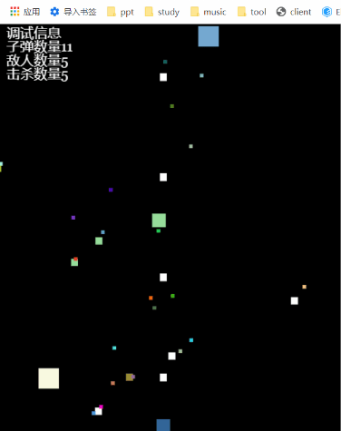
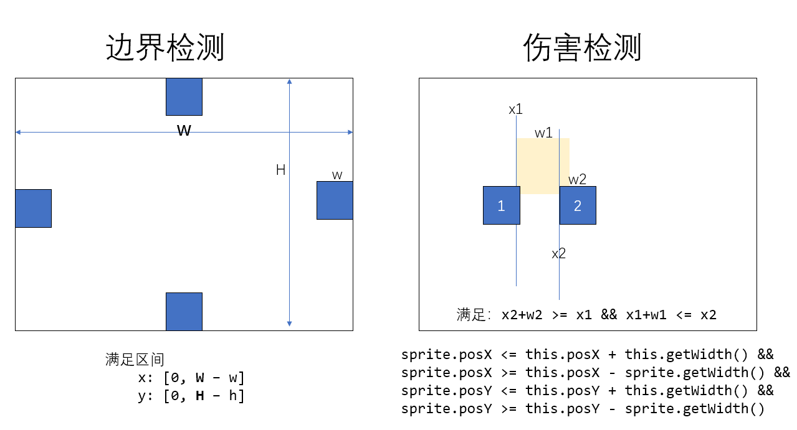

# 飞机大战游戏

## 引言

本项目使用H5 canvas绘制飞机大战游戏，使用ES6 class面向对象开发，目的在于练习js面向对象开发的能力，熟练使用canvas api。

## 一、案例演示

飞机大战游戏，使用canvas绘制，程序仅作练习用，实现主要功能，没有实现游戏开始界面、结束判断等，效果如下图



## 二、知识点

- canvas的基本使用
- 动画requestAnimationFrame的基本使用
- 碰撞、边界检测
- js面向对象编程（OOP）
- 游戏按键事件处理

## 三、案例中的对象

- Stage 舞台
- SceneBase 场景，场景中的基类
- GameScene 游戏场景
- Sprite 精灵类，游戏中的基类
- Enemy 敌机类
- Player 玩家战机类
- Bullet 子弹类
- Particle 粒子类

## 四、实现思路

### 1. Sprite类

游戏所有实体的基类（Player | Enemy | Bullet | Particle均继承此类）

抽象出公共的属性方法，如下：

```
constructor() {
  this.unit = 10;	// 最小单元
  this.vx = 0.2;	// x方向速度
  this.vy = 0.2;	// y方向速度
  this.sizeX = 2;
  this.sizeY = 2;
  this.posX = 0;	// x坐标
  this.posY = 0;	// y坐标
  this.color = '#369';
  this.alive = true;	// 是否存活
  this.birth = new Date();
}
getWidth() {...}	// 获取对象真实大小
render() {...}	// 把此对象绘制在canvas上
```

这里用unit定义了游戏的最小单元，因为这个游戏都是正方形，我不想每次都写20、50、100像素，这样看着数字太大了，定义一个最小单元，用getWidth()通过计算获取实际的大小，即unit * size

### 2. Particle类

用于控制游戏中的粒子效果，继承自Sprite类，扩展方法：

```
this.life	// 对象生命，用于控制何时销毁对象

update() {	// 更新对象状态并调用父类的render方法
  if (new Date() - this.birth > this.life) {
  	this.alive = false;
  }
  this.posX += this.vx;
  this.posY += this.vy;
  this.render();
}
```

### 3. Bullet类

游戏中的子弹类，负责渲染游戏中的子弹，继承自Sprite类，扩展方法：

```
constructor(scene) {
  super();
  this.scene = scene;
  this.vx = 0;
  this.vy = -1;
  this.state = new Date();
  this.particleCB = 500;
  this.type = 0;  // 区分子弹类型 0 enemy, 1 player
}
collide() {...}	// 碰撞检测
createParticle() {...}	// 子弹播放的例子效果
update() {...}	// 更新对象状态并调用父类的render方法
```

子弹类中的碰撞检测**仅负责**判断与场景的碰撞

```
// 传入场景宽高
collide(w, h) {
  if (this.posX < 0 - this.getWidth() ||
    this.posX > w + this.getWidth() ||
    this.posY < 0 - this.getWidth() ||
    this.posY > h + this.getWidth()) {
    this.alive = false;
  }
}
```

子弹运行过程会有粒子效果，这个功能在createParticle()实现

```
let p = new Particle({...});	// new一个实例
this.scene.particles.push(p);	// 把粒子加入场景，统一处理
update() { // 更新对象状态
  if (new Date() - this.state >= this.particleCB) {
    this.createParticle();
    this.state = new Date();
  }
  this.posX += this.vx;
  this.posY += this.vy;
  this.render();
}
```

### 4. Enemy类

游戏中的敌机类，负责渲染游戏中的敌机，继承自Sprite类，扩展方法：

```
constructor(scene) {
  super()
  this.scene = scene
  this.dx = .005	// x方向的加速度
  this.dy = 0	// y方向的加速度
  this.changeCB = 500	// 敌机改变方向的CB
  this.canChange = true
  this.init()
}
init() {
  this.bulletCB = 2000	// 敌机发射子弹的CB
  this.attackTime = -1	// 可以攻击的时间，小于0即可攻击
  this.boomConfig = new Map([	// 配置敌机被击中后的爆炸效果
    [2, [1.5, 1, 0.5]],	// 敌机大小为2，爆炸后分成1.5 1 0.5粒子大小
    [3, [2, 2, 1]]			// 敌机大小为3，爆炸后分成3 3 1粒子大小
  ])
}
collide() {...}	// 碰撞检测
attack() {...}	// 发射子弹
boom() {...}	// 敌机中弹
changeX() {...}	// 敌机AI
changeY() {...}	// 敌机AI
change() {...}	// 敌机AI
update() {...}	// 更新对象状态并调用父类的render方法
```


```
boomConfig中之所以那样配置，是因为在场景类中初始化敌机只有三种大小，这里没有考虑那么灵活，可以在类中加入一个minSize和maxSize控制生成敌机答大小，这里就不做那么复杂了。
// GameScene -> createEnemy()
e.sizeX = Math.random() * 3 + 1 | 0;
```

### 5. Player类

Player类则相对复杂很多，有Enemy类的属性方法外，还需注册键盘事件，（Enemy和Player类这里还可以抽出一个基类，这里就不搞的那么复杂了）

```
  init() {
    this.keydowns = {};
    this.actions = {};
    this.bulletCB = 800;
    this.attackTime = -1;
    this.registAction('a', this.moveLeft.bind(this));
    this.registAction('d', this.moveRight.bind(this));
    this.registAction('w', this.moveUp.bind(this));
    this.registAction('s', this.moveDown.bind(this));
    this.bindEvent();
  }
  registAction(key, callback) {
    this.actions[key] = callback;
  }
  bindEvent() {
    window.addEventListener('keydown', ev => {
      this.keydowns[ev.key] = true;
    })
    window.addEventListener('keyup', ev => {
      this.keydowns[ev.key] = false;
    })
  }
  update() {
    this.edge();	// 边界检测，限制玩家在场景内
    this.damage();	// 伤害检测，子弹、敌机
    let actions = Object.keys(this.actions);
    actions.forEach(k => this.keydowns[k] && this.actions[k]())
    this.attack();
    this.render();
  }  
```

按键响应通过把按键状态和回调函数存在对象的方式，使用registAction注册相应事件，这样代码看上去会简洁很多，仅需在update()中遍历即可。

而对于边界检测和伤害检测则本质是一个区间判断，不同的是，边界检测是限制在一个区间，也就是如果不在这个区间需要限制（或者说是更正）；而伤害检测则是如果在这个区间那么就触发对应的事件，如我方子弹与敌机碰撞，则敌机炸毁，子弹销毁。

下面是图示，其实简单的碰撞检测都是这样子的，比如打砖块



### 6. Scene类

场景类这里抽出了一个基类，SceneBase，当时考虑后期扩展会有游戏主场景，开始场景，设置场景等，所以在这里抽离了一层。

SceneBase类也没定义多少内容，有两个静态属性，WIDTH和HEIGHT，也就是场景大小，像这类属性没必要放在一个个实例中，所有实例共用一个即可，这类属性一般可以放在静态属性中。

真正是GameScene类在负责整个游戏的运作，它继承自SceneBase类，也是游戏的引擎。

init方法则是初始化了游戏的各个参数，

```
  init() {
    super.init();
    this.setEnemyCD = 3000;	// 敌机出现的CB
    this.createEnemyTime = -1
    this.bullets = [];	// 场景中的所有子弹
    this.enemys = [];	// 场景中的所有敌人
    this.particles = [];	// 场景中的粒子
    this.initPlayer();
    this.initEnemy();
    this.warn = false;	// 玩家是否被击中
    this.killCount = 0;
  }
```

update方法则是统一处理场景所有实体的更新

```
  update() {
    super.update();
    this.initEnemy();
    if (this.warn) {
      this.warning();
      this.warn = false;
    } else {
      ctx.clearRect(0, 0, SceneBase.WIDTH, SceneBase.HEIGHT);
    }
    this.player.update();
    this.updateBullet();
    this.updateParticle();
    this.updateEnemy();
    this.updateInfo();
  }
```


### 7. Stage类

负责管理所有的场景，

```
  constructor() {
    this.manager = []
    this.init()
  }
  add() {...}	// 添加场景对manager
  remove() {...}	// 对manager场景移除
  static freeze() {...} // 对manager场景冻结
  static unfreeze() {...} // 对manager场景解冻
  bindEvent() {...} // 一些事件响应
```

这个东西在此次案例并没太多体现，是我在层叠消融游戏案例中抽离出来的，运用在多场景切换中，比如一个是游戏游玩模式，一个是游戏自定义编辑模式，是这种情况下使用的


